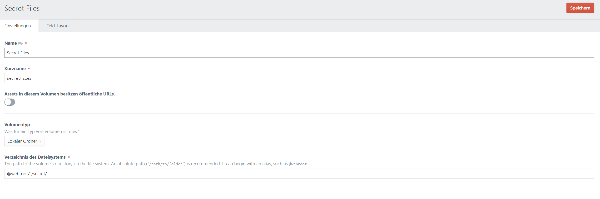

# ServeSecret plugin for Craft CMS 3.x


___

Serve files that are not Stored in public accessable Directories. e.g for Password Protected Areas. File links could and should not be shared!

The file links are decoded to hide the path from the user and to make the link only accessable for the current Session, so thats the reason why its not possible to share the links!

## Requirements

This plugin requires Craft CMS 3.0.0 or later.

## Contribute to the Project

if you want to help with this project, [read how to contribute](CONTRIBUTE.md)

## Installation

To install the plugin, follow these instructions.

1. Open your terminal and go to your Craft project:

        cd /path/to/project

2. Then tell Composer to load the plugin:

        composer require itscoding/serve-secret

3. In the Control Panel, go to Settings → Plugins and click the “Install” button for ServeSecret.


## Using ServeSecret



1. Crate a volume in craft (start with `@webroot` is recommended but it should work also with absolute paths

2. Use it in your templates --> put your asset as an method argument!


```twig
# the second parameter is optional, if is set to false, the file will download instead of open in the browser,the default value is true
<a href="{{ secretFile(entry.files.first(),false) }}">{{ entry.files.first().title }}</a>


       <a href="{{ secretFile(file,true) }}">{{ file.title }}</a>


```

## ServeSecret Roadmap

Some things to do, and ideas for potential features:

* Implement possibility to share the file-links

Brought to you by [Simon Müller](https://itscoding.ch)
